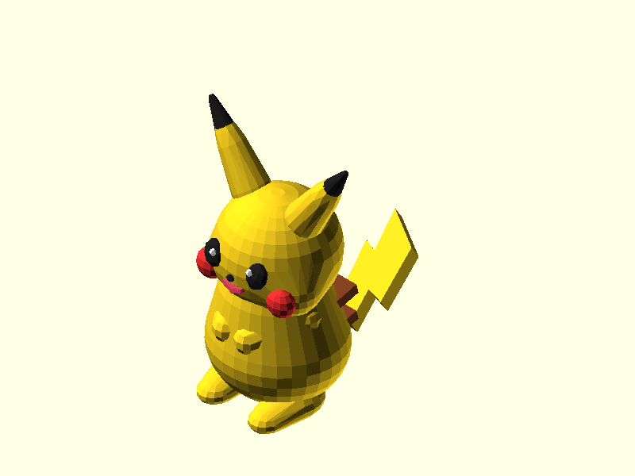
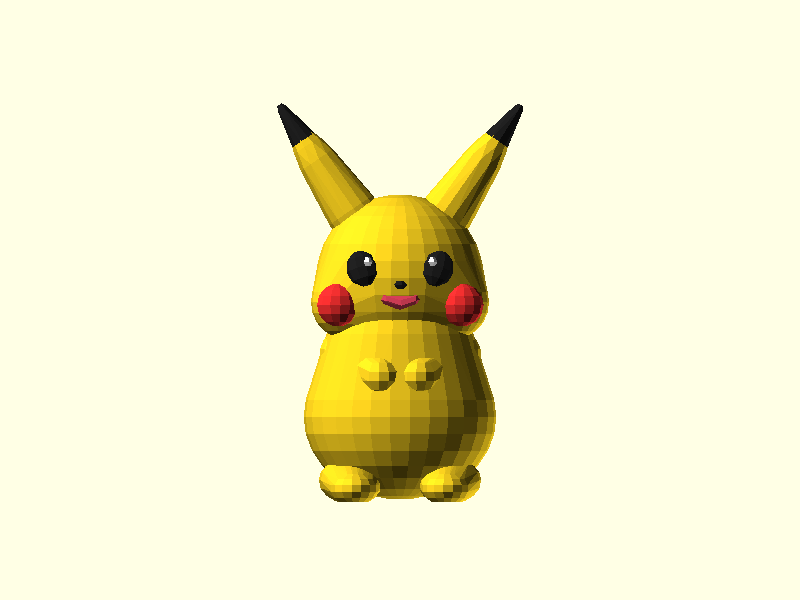
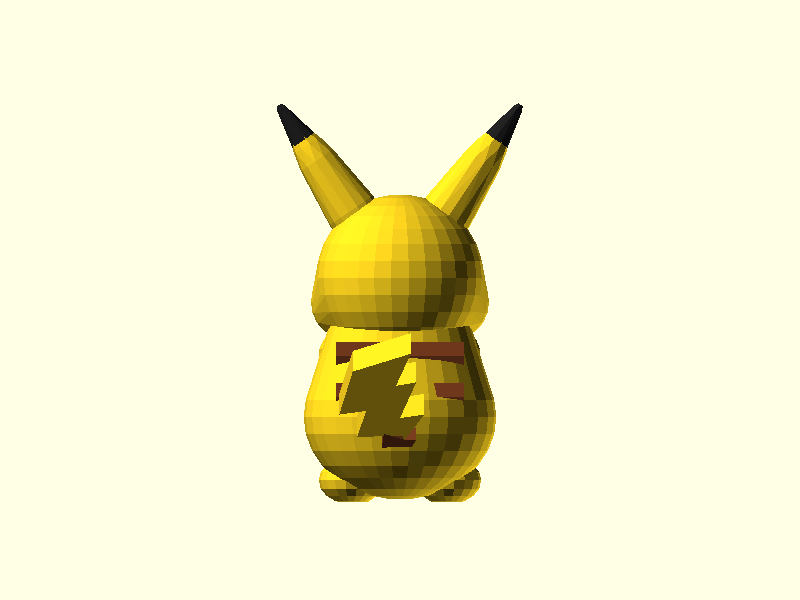

# Mô hình Pikachu Mini 3cm Đầy Đủ Màu Sắc (Full-Color 3D Printable Pikachu)

Mô hình tượng Pikachu mini tỉ lệ cao ~30mm (3cm), được thiết kế tham số chuẩn xác bằng OpenSCAD và xác thực chất lượng qua **OpenSCAD Design MCP Server**.

---

## 📸 Hình ảnh xem trước (Previews)

| Góc Nhìn Đẳng Cự (Isometric) | Mặt Trước (Front) | Mặt Sau (Back) |
| :---: | :---: | :---: |
|  |  |  |

---

## 🎨 Bảng mã màu chuẩn (Official Color Palette)

Mô hình tích hợp bảng màu chuẩn của Pikachu trong OpenSCAD:

| Bộ phận | Tên màu | Mã RGB OpenSCAD | Mã HEX |
| :--- | :--- | :--- | :--- |
| **Thân, Đầu, Tai, Tay, Chân, Đuôi** | Golden Yellow | `[0.98, 0.82, 0.12]` | `#FAD11F` |
| **Chóp tai, Mắt, Mũi** | Jet Black | `[0.12, 0.12, 0.12]` | `#1F1F1F` |
| **Má điện (Electric Cheeks)** | Bright Red | `[0.92, 0.18, 0.18]` | `#EB2E2E` |
| **Đốm sáng trong mắt (Sparkle)** | Pure White | `[0.98, 0.98, 0.98]` | `#FAFAFA` |
| **Gốc đuôi & Sọc lưng** | Chocolate Brown | `[0.48, 0.24, 0.12]` | `#7A3D1F` |
| **Miệng** | Rosy Pink | `[0.85, 0.25, 0.35]` | `#D94059` |

---

## 📐 Thông số kỹ thuật (Mesh & Dimensions)

- **Kích thước thực tế**:
  - Chiều cao ($Z$): **29.54 mm** (~3.0 cm)
  - Chiều rộng ($X$): **18.28 mm**
  - Chiều sâu ($Y$): **24.03 mm**
- **Thể tích (Volume)**: $2,629.91 \text{ mm}^3$ (~$2.63 \text{ cm}^3$)
- **Diện tích bề mặt**: $1,360.48 \text{ mm}^2$
- **Độ kín nước (Watertight / 2-Manifold)**: ✅ Đạt chuẩn 100% (0 non-manifold edges, 0 boundary edges).
- **Đáy phẳng (Flat Base)**: Đáy phẳng tại $Z=0$ đảm bảo bám bàn in (Bed Adhesion) vững chắc.

---

## 🖨️ Hướng dẫn In 3D (3D Printing Guide)

### 1. In đơn màu (Single Color FDM / SLA Resin)
- Sử dụng file: `pikachu_3cm_solid.stl`
- **Layer Height**: 0.08mm - 0.12mm (FDM) hoặc 0.05mm (Resin) để đạt độ nét tối đa trên chi tiết nhỏ.
- **Infill**: 15% - 20% (Gyroid hoặc Grid).
- **Supports**: Chỉ cần Tree Supports góc $50^\circ$ ở cằm và tay nhỏ.

### 2. In đa màu (Bambu Lab AMS / Prusa MMU / Multi-Material)
Trong file [pikachu.scad](file:///d:/Code/openscad-design-mcp/pikachu_design/pikachu.scad), bạn có thể đổi biến `part` để xuất riêng từng file STL theo màu:
- `part = "yellow"`: Thân, đầu, gốc tai, tay, chân, phần ngọn đuôi.
- `part = "black"`: Chóp tai, mắt, mũi.
- `part = "red"`: 2 má đỏ tròn.
- `part = "brown"`: 2 sọc lưng và khúc đuôi màu nâu.
- `part = "white"`: 2 đốm sáng trong mắt.
Sau đó import toàn bộ vào slicer (Bambu Studio / OrcaSlicer / PrusaSlicer) dưới dạng **Multi-part Assembly**.
